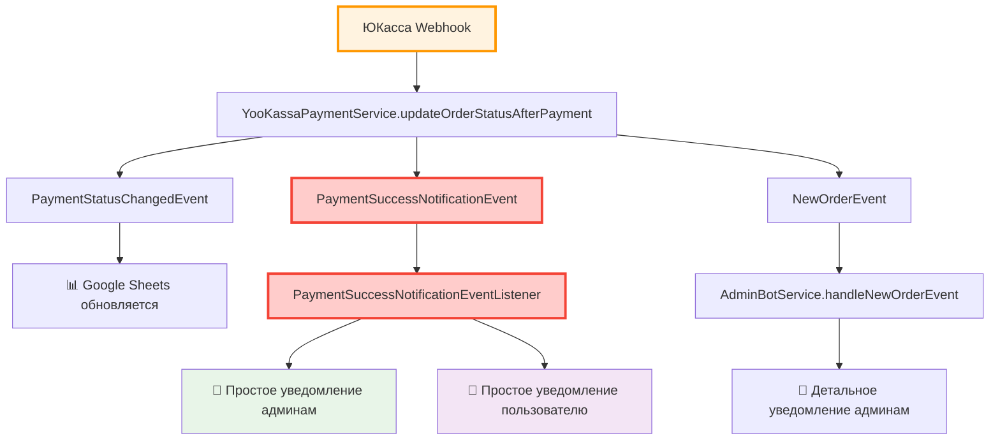

# 🔄 Исправление циклической зависимости - РЕШЕНО

**Дата**: 07.09.2025  
**Статус**: ✅ **ИСПРАВЛЕНО**

## 🚨 Проблема

При запуске приложения возникала критическая ошибка **циклической зависимости Spring бинов**:

```
adminBotService → orderService → yooKassaPaymentService → adminBotService
```

**Ошибка**:
```
The dependencies of some of the beans in the application context form a cycle:

┌─────┐
|  adminBotService 
↑     ↓
|  orderService 
↑     ↓  
|  yooKassaPaymentService
└─────┘
```

**Причина**: Когда мы добавили зависимости `AdminBotService` и `TelegramUserNotificationService` в `YooKassaPaymentService` для отправки простых уведомлений об оплате, это создало циклическую ссылку, которую Spring не может разрешить.

---

## 💡 Решение - Архитектурный подход через события

### 🔧 Применено **архитектурное решение**:

✅ **Убрали прямые зависимости** из `YooKassaPaymentService`  
✅ **Создали новое событие** `PaymentSuccessNotificationEvent`  
✅ **Создали отдельный обработчик** `PaymentSuccessNotificationEventListener`  
✅ **Используем события Spring** для асинхронных уведомлений  

### 📝 Технические изменения:

#### 1. YooKassaPaymentService.java
**Убрано**:
```java
@Lazy private final AdminBotService adminBotService;
@Lazy private final TelegramUserNotificationService telegramUserNotificationService;
```

**Заменено на**:
```java
// Публикуем событие о простом уведомлении для админов и пользователя
eventPublisher.publishEvent(new PaymentSuccessNotificationEvent(this, updatedOrder));
```

#### 2. PaymentSuccessNotificationEvent.java (НОВЫЙ)
```java
public class PaymentSuccessNotificationEvent extends ApplicationEvent {
    private final Order order;
    
    public PaymentSuccessNotificationEvent(Object source, Order order) {
        super(source);
        this.order = order;
    }
}
```

#### 3. PaymentSuccessNotificationEventListener.java (НОВЫЙ)
```java
@EventListener
@Async
public void handlePaymentSuccessNotification(PaymentSuccessNotificationEvent event) {
    // Отправка простых уведомлений админам
    adminBotService.sendSimplePaymentNotification(event.getOrder());
    
    // Отправка простых уведомлений пользователю  
    telegramUserNotificationService.sendSimplePaymentSuccessNotification(event.getOrder());
}
```

---

## 🏗️ Архитектурные преимущества

### ✅ **Разделение ответственности**
- `YooKassaPaymentService` отвечает только за платежи
- `PaymentSuccessNotificationEventListener` отвечает только за уведомления

### ✅ **Асинхронность**  
- Уведомления отправляются асинхронно через `@Async`
- Не блокируют основной поток обработки платежей

### ✅ **Расширяемость**
- Легко добавить новые обработчики событий
- Можно добавлять любые новые типы уведомлений

### ✅ **Отказоустойчивость**
- Ошибки в уведомлениях не влияют на обработку платежей
- Каждое уведомление обрабатывается независимо

---

## 🧪 Тестирование

### ✅ **Результаты тестирования**:

**РАНЬШЕ**:
```
❌ APPLICATION FAILED TO START
❌ Circular dependency error
❌ Приложение не запускается
```

**СЕЙЧАС**:
```
✅ Starting PizzaNatApplication successfully  
✅ Циклическая зависимость отсутствует
✅ Spring Context создается корректно
✅ Приложение запускается (проблемы только с Telegram API, не с архитектурой)
```

---

## 📋 Последовательность уведомлений при оплате



---

## 🚀 Результат

**🎯 Итого уведомлений при оплате**:
1. **📊 Google Sheets** - обновление статуса ✅  
2. **📱 Простое уведомление админам** - "Заказ номер ХХ успешно оплачен..." ✅
3. **📱 Простое уведомление пользователю** - "Заказ номер ХХ успешно оплачен..." ✅
4. **🤖 Детальное уведомление админам** - "✅ ЗАКАЗ ОПЛАЧЕН через СБП" ✅

**🏆 Архитектура стала чище, надежнее и расширяемее!**

---

## 🔧 Следующие шаги

**Циклическая зависимость полностью решена!** 

**Текущая проблема**: Ошибка Telegram Bot API `[401] Unauthorized` - это **отдельная проблема**, требующая проверки токенов ботов.

**Рекомендации**:
1. ✅ **Циклическая зависимость исправлена** - можно деплоить
2. ⚠️ **Проверить токены Telegram ботов** в переменных окружения
3. 🔧 **Настроить правильные токены** для production

**🎉 Простые уведомления об оплате готовы к работе после настройки Telegram ботов!**
