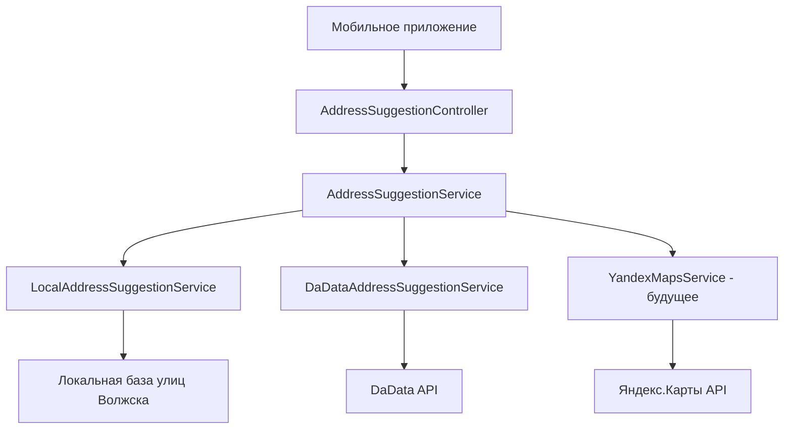

# Руководство по реализации автоподсказок адресов в PizzaNat

## 📋 Обзор

Система автоподсказок адресов предназначена для улучшения пользовательского опыта в мобильном приложении при вводе адреса доставки. Система поддерживает только город **Волжск, Республика Марий Эл** и предоставляет автоподсказки улиц и номеров домов.

## 🏗️ Архитектура системы

### Компоненты

1. **AddressSuggestionService** - основной сервис-фасад
2. **LocalAddressSuggestionService** - локальная база данных улиц
3. **DaDataAddressSuggestionService** - интеграция с DaData API
4. **AddressSuggestionController** - REST API контроллер
5. **AddressSuggestion DTO** - модель данных

### Диаграмма архитектуры



## 🚀 Варианты реализации

### Вариант 1: Только локальная база (Рекомендуется для начала)

**Преимущества:**
- ✅ Быстрая работа без зависимости от внешних API
- ✅ Нет ограничений по количеству запросов
- ✅ Полный контроль над данными
- ✅ Работает офлайн

**Недостатки:**
- ❌ Ограниченная точность данных
- ❌ Нужно вручную поддерживать актуальность

**Реализация:**
```java
// Уже реализовано в LocalAddressSuggestionService
// 34 улицы Волжска + автогенерация номеров домов
```

### Вариант 2: Интеграция с DaData API

**Преимущества:**
- ✅ Высокая точность российских адресов
- ✅ Актуальные данные ФИАС
- ✅ Поддержка координат
- ✅ Бесплатный тариф до 10,000 запросов/месяц

**Недостатки:**
- ❌ Требует API ключ
- ❌ Зависимость от внешнего сервиса
- ❌ Ограничения по запросам

**Настройка:**
```properties
dadata.api.enabled=true
dadata.api.key=YOUR_DADATA_API_KEY
```

### Вариант 3: Интеграция с Яндекс.Карты API

**Преимущества:**
- ✅ Отличное качество данных для России
- ✅ Поддержка геокодирования
- ✅ Бесплатный лимит до 25,000 запросов/месяц

**Недостатки:**
- ❌ Требует API ключ
- ❌ Более сложная интеграция

**Настройка:**
```properties
yandex.maps.api.enabled=true
yandex.maps.api.key=YOUR_YANDEX_API_KEY
```

## 📱 Интеграция с мобильным приложением

### 1. Автоподсказки улиц

**Endpoint:** `GET /api/v1/address/suggestions?query={text}`

**Пример использования:**
```kotlin
// Android Kotlin
class AddressAutocompleteService {
    
    suspend fun getStreetSuggestions(query: String): List<AddressSuggestion> {
        if (query.length < 2) return emptyList()
        
        return try {
            val response = apiService.getAddressSuggestions(query)
            response.filter { it.address.contains("Волжск", ignoreCase = true) }
        } catch (e: Exception) {
            emptyList()
        }
    }
}
```

**Пример ответа:**
```json
[
  {
    "address": "Республика Марий Эл, Волжск, улица Ленина",
    "shortAddress": "Волжск, улица Ленина",
    "latitude": 55.866,
    "longitude": 48.359,
    "source": "local",
    "metadata": "street"
  }
]
```

### 2. Автоподсказки номеров домов

**Endpoint:** `GET /api/v1/address/houses?street={street}&houseQuery={number}`

**Пример использования:**
```kotlin
suspend fun getHouseSuggestions(street: String, houseQuery: String?): List<AddressSuggestion> {
    return try {
        apiService.getHouseSuggestions(street, houseQuery)
    } catch (e: Exception) {
        emptyList()
    }
}
```

### 3. UI компонент с автоподсказками

```kotlin
@Composable
fun AddressAutocompleteField(
    value: String,
    onValueChange: (String) -> Unit,
    onAddressSelected: (AddressSuggestion) -> Unit
) {
    var suggestions by remember { mutableStateOf<List<AddressSuggestion>>(emptyList()) }
    var isLoading by remember { mutableStateOf(false) }
    
    LaunchedEffect(value) {
        if (value.length >= 2) {
            isLoading = true
            suggestions = getStreetSuggestions(value)
            isLoading = false
        } else {
            suggestions = emptyList()
        }
    }
    
    Column {
        OutlinedTextField(
            value = value,
            onValueChange = onValueChange,
            label = { Text("Адрес доставки") },
            trailingIcon = {
                if (isLoading) {
                    CircularProgressIndicator(modifier = Modifier.size(16.dp))
                }
            }
        )
        
        if (suggestions.isNotEmpty()) {
            LazyColumn(
                modifier = Modifier.heightIn(max = 200.dp)
            ) {
                items(suggestions) { suggestion ->
                    AddressSuggestionItem(
                        suggestion = suggestion,
                        onClick = { onAddressSelected(suggestion) }
                    )
                }
            }
        }
    }
}
```

## 🔧 Настройка и конфигурация

### 1. Переменные окружения

```env
# Яндекс.Карты API
YANDEX_MAPS_API_ENABLED=false
YANDEX_MAPS_API_KEY=your_yandex_api_key

# DaData API  
DADATA_API_ENABLED=false
DADATA_API_KEY=your_dadata_api_key
```

### 2. Docker Compose

```yaml
services:
  app:
    environment:
      # Автоподсказки адресов
      - YANDEX_MAPS_API_ENABLED=${YANDEX_MAPS_API_ENABLED:-false}
      - YANDEX_MAPS_API_KEY=${YANDEX_MAPS_API_KEY:-}
      - DADATA_API_ENABLED=${DADATA_API_ENABLED:-false}
      - DADATA_API_KEY=${DADATA_API_KEY:-}
```

### 3. Получение API ключей

#### DaData API:
1. Регистрация на [dadata.ru](https://dadata.ru)
2. Получение бесплатного API ключа
3. Лимит: 10,000 запросов/месяц

#### Яндекс.Карты API:
1. Регистрация в [developer.tech.yandex.ru](https://developer.tech.yandex.ru)
2. Создание приложения
3. Получение API ключа
4. Лимит: 25,000 запросов/месяц

## 🧪 Тестирование

### Запуск тестов

```bash
# Запуск всех тестов автоподсказок
./test_address_suggestions.sh

# Тестирование конкретного API
curl "http://localhost:8080/api/v1/address/suggestions?query=ул"
```

### Тестовые сценарии

1. **Поиск улиц**: `ул`, `Ленина`, `107`
2. **Поиск домов**: `улица Ленина`, `улица Ленина` + `1`
3. **Валидация**: корректные и некорректные адреса
4. **Edge cases**: короткие запросы, пустые поля

## 📊 Мониторинг и метрики

### Логирование

```java
log.info("Получение автоподсказок адресов для запроса: {}", query);
log.info("Найдено {} автоподсказок для запроса: {}", suggestions.size(), query);
```

### Метрики для мониторинга

- Количество запросов к API автоподсказок
- Время ответа API
- Количество успешных/неуспешных запросов к внешним API
- Процент использования локальной базы vs внешних API

## 🔄 Поэтапное внедрение

### Этап 1: Базовая функциональность (Текущий)
- ✅ Локальная база данных улиц Волжска
- ✅ REST API для автоподсказок
- ✅ Базовая валидация адресов

### Этап 2: Интеграция с внешними API
- [ ] Настройка DaData API
- [ ] Настройка Яндекс.Карты API
- [ ] Автоматический fallback между источниками

### Этап 3: Улучшения UX
- [ ] Кэширование популярных запросов
- [ ] Геолокация для более точных подсказок
- [ ] Поддержка сокращений ("ул.", "д.")

### Этап 4: Аналитика
- [ ] Метрики использования
- [ ] A/B тестирование различных источников данных
- [ ] Оптимизация производительности

## 🚨 Возможные проблемы и решения

### 1. Медленные внешние API
**Решение:** Установка таймаутов и fallback на локальную базу

### 2. Исчерпание лимитов API
**Решение:** Кэширование запросов и мониторинг использования

### 3. Неточные данные в локальной базе
**Решение:** Регулярное обновление базы улиц из официальных источников

### 4. Проблемы с кодировкой
**Решение:** Использование UTF-8 везде и корректная обработка русских символов

## 📞 Поддержка

При возникновении проблем:

1. Проверьте логи приложения
2. Запустите тестовый скрипт `test_address_suggestions.sh`
3. Проверьте конфигурацию API ключей
4. Убедитесь в доступности внешних API

---

*Документ создан: 22.06.2025*  
*Версия системы: 1.0.0* 