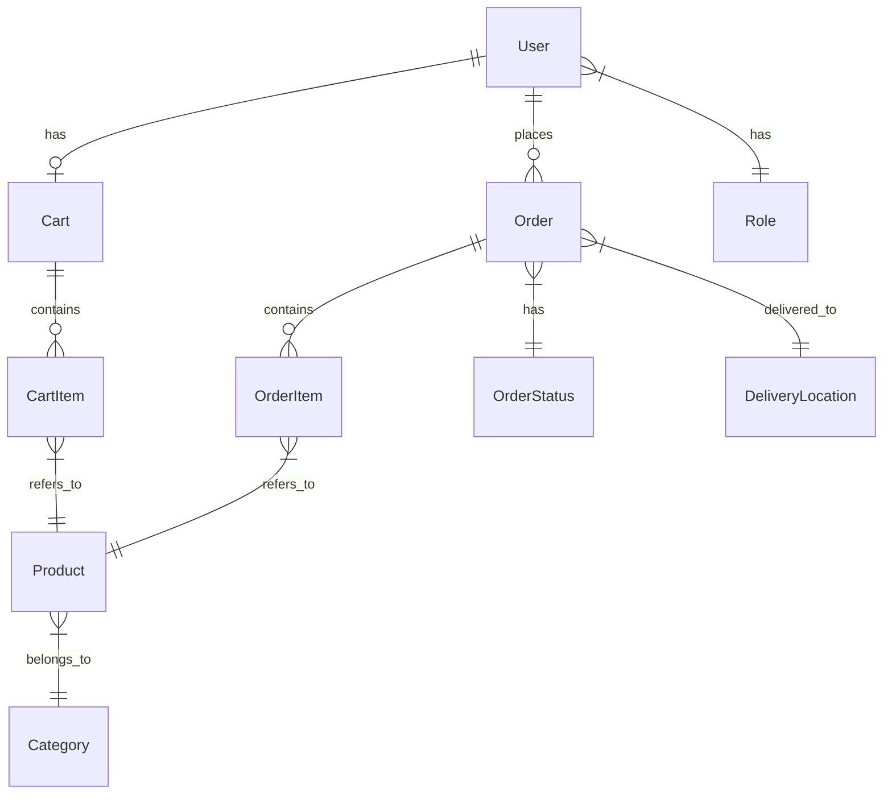

# PizzaNat - Микросервис для заказа пиццы

## Содержание
1. [Обзор проекта](#обзор-проекта)
2. [Цели проекта](#цели-проекта)
3. [Архитектура](#архитектура)
4. [Технологический стек](#технологический-стек)
5. [Компоненты системы](#компоненты-системы)
6. [Модель данных](#модель-данных)
7. [API](#api)
8. [Безопасность](#безопасность)
9. [Масштабируемость и отказоустойчивость](#масштабируемость-и-отказоустойчивость)
10. [Деплой и инфраструктура](#деплой-и-инфраструктура)
11. [Мониторинг и логирование](#мониторинг-и-логирование)
12. [Дорожная карта развития](#дорожная-карта-развития)
13. [Стандарты разработки](#стандарты-разработки)
14. [Тестирование](#тестирование)

## Обзор проекта

PizzaNat - это микросервис для заказа пиццы, который предоставляет полный функционал для работы онлайн-пиццерии. Проект разработан как основа для последующего масштабирования с добавлением мобильного приложения и веб-сайта.

Система обеспечивает следующие основные возможности:
- Управление каталогом продуктов (пиццы, напитки, десерты)
- Управление корзиной пользователя
- Оформление и отслеживание заказов
- Регистрация и аутентификация пользователей
- Управление доставкой
- Административный интерфейс для управления всеми аспектами работы

## Цели проекта

1. **Бизнес-цели**:
   - Создание полноценной системы для продажи пиццы онлайн
   - Обеспечение масштабируемости для роста бизнеса
   - Повышение удовлетворенности клиентов через удобный процесс заказа

2. **Технические цели**:
   - Разработка отказоустойчивой архитектуры
   - Минимизация операционных расходов на инфраструктуру
   - Обеспечение высокой производительности и быстрого отклика системы
   - Защита данных пользователей и бизнес-информации
   - Создание основы для интеграции с мобильными и веб-клиентами

## Архитектура

PizzaNat использует микросервисную архитектуру, основанную на принципах Domain-Driven Design (DDD). В текущей реализации представлен первый монолитный микросервис, который в дальнейшем может быть разделен на более специализированные сервисы.

### Архитектурные принципы

1. **Разделение ответственности (SoC)** - каждый компонент отвечает за конкретную бизнес-функцию
2. **Изоляция данных** - каждый микросервис имеет свое хранилище данных
3. **API-First подход** - все взаимодействия осуществляются через четко определенные API
4. **Горизонтальная масштабируемость** - возможность масштабирования каждого компонента независимо
5. **Отказоустойчивость** - система продолжает работать при отказе отдельных компонентов

### Уровни архитектуры

1. **Уровень представления**:
   - REST API контроллеры для взаимодействия с клиентами
   - Обработка запросов и формирование ответов
   - Валидация входных данных

2. **Бизнес-уровень**:
   - Сервисы, реализующие бизнес-логику
   - Транзакционное управление
   - Обработка бизнес-правил и ограничений

3. **Уровень доступа к данным**:
   - Репозитории для взаимодействия с базой данных
   - Кэширование данных
   - Управление постоянством объектов

4. **Уровень инфраструктуры**:
   - Конфигурация безопасности
   - Управление миграциями БД
   - Интеграция с внешними сервисами (хранилище файлов, email)

## Технологический стек

### Бэкенд:
- **Язык программирования**: Java 17
- **Фреймворк**: Spring Boot 3.4.5
- **Управление зависимостями**: Gradle
- **Безопасность**: Spring Security, JWT
- **Доступ к данным**: Spring Data JPA, Hibernate
- **Кэширование**: Redis, Spring Cache
- **Миграции БД**: Flyway
- **Документация API**: SpringDoc OpenAPI

### Хранение данных:
- **СУБД**: PostgreSQL 15
- **Кэш**: Redis 7
- **Хранилище файлов**: MinIO (S3-совместимое)

### Инфраструктура:
- **Контейнеризация**: Docker, Docker Compose
- **Веб-сервер**: Nginx (для проксирования и SSL-терминации)
- **CI/CD**: (будет добавлено позднее)

### Будущие компоненты:
- **Мониторинг**: Prometheus, Grafana
- **Трассировка**: Jaeger/Zipkin
- **Журналирование**: ELK Stack/Loki
- **Очереди сообщений**: Kafka/RabbitMQ

## Компоненты системы

### Основные модули

1. **Модуль аутентификации и авторизации**:
   - Регистрация и аутентификация пользователей
   - Управление ролями и разрешениями
   - Выдача и валидация JWT токенов

2. **Модуль управления продуктами**:
   - Управление каталогом продуктов
   - Категоризация продуктов
   - Управление ценами и акциями

3. **Модуль корзины**:
   - Добавление/удаление товаров
   - Расчет стоимости
   - Сохранение состояния корзины между сессиями

4. **Модуль заказов**:
   - Создание заказов
   - Отслеживание статуса заказов
   - История заказов пользователя

5. **Модуль доставки**:
   - Управление пунктами выдачи
   - Расчет стоимости доставки
   - Отслеживание доставки

6. **Административный модуль**:
   - Управление пользователями
   - Управление каталогом
   - Аналитика и отчеты

7. **Модуль нотификаций**:
   - Email-уведомления
   - SMS-уведомления (планируется)
   - Push-уведомления (планируется)

## Модель данных

### Ключевые сущности

1. **User** - пользователь системы
   - Основные атрибуты: id, username, password, email, firstName, lastName, phone
   - Связи: роли, заказы, корзина

2. **Role** - роль пользователя
   - Основные атрибуты: id, name
   - Связи: пользователи

3. **Product** - продукт (пицца, напиток и т.д.)
   - Основные атрибуты: id, name, description, price, imageUrl, weight, isAvailable, isSpecialOffer
   - Связи: категория, элементы корзины, элементы заказа

4. **Category** - категория продуктов
   - Основные атрибуты: id, name, description, imageUrl
   - Связи: продукты

5. **Cart** - корзина пользователя
   - Основные атрибуты: id, totalAmount
   - Связи: пользователь, элементы корзины

6. **CartItem** - элемент корзины
   - Основные атрибуты: id, quantity, price
   - Связи: корзина, продукт

7. **Order** - заказ
   - Основные атрибуты: id, totalAmount, comment, contactName, contactPhone, createdAt, updatedAt
   - Связи: пользователь, статус заказа, адрес доставки, элементы заказа

8. **OrderItem** - элемент заказа
   - Основные атрибуты: id, quantity, price
   - Связи: заказ, продукт

9. **OrderStatus** - статус заказа
   - Основные атрибуты: id, name, description
   - Связи: заказы

10. **DeliveryLocation** - пункт выдачи/доставки
    - Основные атрибуты: id, address, description, isActive
    - Связи: заказы

### ER-диаграмма

## API

API построено по принципам REST и использует HTTP методы для операций с ресурсами:

- GET - получение ресурсов
- POST - создание ресурсов
- PUT - полное обновление ресурсов
- PATCH - частичное обновление ресурсов
- DELETE - удаление ресурсов

### Основные эндпоинты

1. **Аутентификация**:
   - `POST /api/v1/auth/register` - регистрация нового пользователя
   - `POST /api/v1/auth/login` - аутентификация пользователя

2. **Категории**:
   - `GET /api/v1/categories` - получение всех категорий
   - `GET /api/v1/categories/{id}` - получение категории по ID

3. **Продукты**:
   - `GET /api/v1/products` - получение всех продуктов
   - `GET /api/v1/products/{id}` - получение продукта по ID
   - `GET /api/v1/products/category/{categoryId}` - получение продуктов по категории
   - `GET /api/v1/products/special-offers` - получение специальных предложений
   - `GET /api/v1/products/search?query=text` - поиск продуктов

4. **Корзина**:
   - `GET /api/v1/cart` - получение корзины пользователя
   - `POST /api/v1/cart/items` - добавление товара в корзину
   - `PUT /api/v1/cart/items/{productId}` - изменение количества товара
   - `DELETE /api/v1/cart/items/{productId}` - удаление товара из корзины

5. **Заказы**:
   - `POST /api/v1/orders` - создание заказа
   - `GET /api/v1/orders` - получение всех заказов пользователя
   - `GET /api/v1/orders/{id}` - получение заказа по ID

6. **Доставка**:
   - `GET /api/v1/delivery-locations` - получение пунктов выдачи

7. **Административный API**:
   - `GET /api/v1/admin/orders` - получение всех заказов
   - `PUT /api/v1/admin/orders/{id}/status` - обновление статуса заказа
   - `POST /api/v1/admin/products` - создание продукта
   - `PUT /api/v1/admin/products/{id}` - обновление продукта
   - `DELETE /api/v1/admin/products/{id}` - удаление продукта

### Документация API

Полная документация API доступна через Swagger UI по адресу `/swagger-ui.html`. Документация генерируется автоматически на основе аннотаций контроллеров и моделей.

## Безопасность

### Аутентификация и авторизация

1. **JWT-аутентификация**:
   - Токены JWT для авторизации запросов
   - Хранение токенов на стороне клиента
   - Проверка подписи и срока действия токенов

2. **Ролевая модель**:
   - Роли: USER, ADMIN
   - Разграничение доступа на уровне эндпоинтов
   - Проверка разрешений на уровне сервисов

### Защита данных

1. **Хранение паролей**:
   - BCrypt хеширование паролей
   - Защита от атак подбора

2. **Защита от CSRF и XSS**:
   - CSRF-токены для защищенных операций
   - Валидация входных данных
   - Кодирование выходных данных

3. **Аудит безопасности**:
   - Логирование действий пользователей
   - Мониторинг подозрительной активности

### Защита API

1. **Rate Limiting**:
   - Ограничение количества запросов с одного IP
   - Предотвращение DoS-атак

2. **Валидация входных данных**:
   - Проверка всех входных данных
   - Защита от SQL-инъекций и других атак

## Масштабируемость и отказоустойчивость

### Масштабируемость

1. **Горизонтальное масштабирование**:
   - Возможность запуска нескольких экземпляров сервиса
   - Балансировка нагрузки через Nginx

2. **Кэширование**:
   - Использование Redis для кэширования данных
   - Снижение нагрузки на базу данных

3. **Оптимизация базы данных**:
   - Индексирование часто используемых полей
   - Оптимизация запросов

### Отказоустойчивость

1. **Отказоустойчивость хранения данных**:
   - Репликация PostgreSQL
   - Резервное копирование данных

2. **Отказоустойчивость приложения**:
   - Механизм повторных попыток для внешних сервисов
   - Circuit Breaker для предотвращения каскадных сбоев

3. **Мониторинг и оповещение**:
   - Мониторинг ключевых метрик
   - Оповещение о сбоях и аномалиях

## Деплой и инфраструктура

### Локальная разработка

1. **Docker Compose**:
   - Запуск всех необходимых сервисов локально
   - Конфигурация для разработки

2. **Профили Spring**:
   - `dev` - для локальной разработки
   - `prod` - для продакшн-окружения

### Продакшн-окружение

1. **Контейнеризация**:
   - Docker-образы для всех компонентов
   - Оркестрация через Docker Compose (в будущем K8s)

2. **Балансировка нагрузки**:
   - Nginx как обратный прокси
   - SSL-терминация

3. **Мониторинг**:
   - Prometheus для сбора метрик
   - Grafana для визуализации

## Мониторинг и логирование

### Мониторинг

1. **Метрики приложения**:
   - Производительность API
   - Время отклика
   - Количество запросов

2. **Метрики системы**:
   - Использование CPU/RAM
   - Использование диска
   - Сетевая активность

### Логирование

1. **Уровни логирования**:
   - ERROR - критические ошибки
   - WARN - предупреждения
   - INFO - информационные сообщения
   - DEBUG - отладочная информация

2. **Централизованное хранение логов**:
   - Агрегация логов из всех экземпляров
   - Долгосрочное хранение

## Дорожная карта развития

### Версия 1.0 (Текущая)
- Базовый функционал заказа пиццы
- Авторизация и регистрация
- Управление корзиной и заказами
- Административный интерфейс

### Версия 1.1
- Интеграция с системами оплаты
- Расширенные отчеты для администраторов
- Улучшение системы уведомлений

### Версия 2.0
- Разделение на отдельные микросервисы
- API Gateway для единой точки входа
- Мобильное приложение

### Версия 3.0
- Веб-приложение для клиентов
- Программа лояльности
- Интеграция с CRM-системами

## Стандарты разработки

### Код

1. **Стиль кода**:
   - Следование Java Code Conventions
   - Использование Lombok для уменьшения шаблонного кода
   - Документирование классов и методов

2. **Архитектурные принципы**:
   - SOLID принципы
   - DRY (Don't Repeat Yourself)
   - KISS (Keep It Simple, Stupid)

3. **Тестирование**:
   - Модульные тесты для бизнес-логики
   - Интеграционные тесты для API
   - Тестирование с использованием Testcontainers

### Процесс разработки

1. **Контроль версий**:
   - Git Flow для управления ветками
   - Семантическое версионирование

2. **Code Review**:
   - Обязательное ревью кода перед слиянием
   - Автоматические проверки стиля и качества кода

3. **CI/CD**:
   - Автоматическая сборка
   - Автоматические тесты
   - Автоматический деплой

## Тестирование

### Интеграционные тесты

В проекте настроены интеграционные тесты для проверки работы основных контроллеров. Для тестирования используются:

- **H2** - встроенная база данных для тестов
- **Заглушки** для внешних сервисов (Redis, Mail, S3/MinIO)
- **Spring Security** с отключенной проверкой JWT для тестов

Основные компоненты тестовой инфраструктуры:
- `BaseIntegrationTest` - базовый класс для всех интеграционных тестов
- `TestConfig` - основная тестовая конфигурация
- `TestRedisConfig`, `TestMailConfig`, `TestS3Config` - заглушки для соответствующих сервисов
- `GlobalExceptionHandler` - обработчик исключений для API

### Обнаруженные проблемы

1. **Проблемы с конфигурацией Spring Security для тестов**
   - Тесты для CartController не проходят из-за проблем с авторизацией
   - Требуется дополнительная настройка для отключения проверки JWT в тестах

2. **Обработка null значений в расчетах**
   - В `CartService` и `CartItem` добавлена проверка на null для discountedPrice

3. **Несоответствие типов данных**
   - Исправлены несоответствия между типами Long и Integer в моделях и тестах

### Текущий статус тестов

- ✅ **AuthController** - все тесты проходят успешно
- ✅ **CategoryController** - все тесты проходят успешно
- ❌ **CartController** - тесты не проходят (проблемы с безопасностью)
- ❓ **ProductController** - тесты не настроены
- ❓ **OrderController** - тесты не настроены
- ❓ **PaymentController** - тесты не настроены