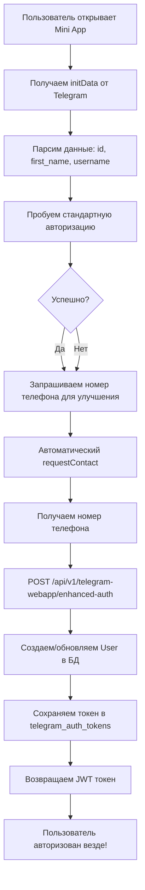

# Система кросс-платформенной авторизации через Telegram Mini App

## 🎯 Цель реализации

Создание **единой системы авторизации** между Telegram Mini App, мобильным приложением и веб-сайтом, где пользователь авторизуется один раз в Mini App и получает доступ ко всем платформам.

## 📋 Архитектура решения

### 🔄 **Поток авторизации в Mini App**



### 🏗️ **Компоненты системы**

#### 1. **Бэкенд (Spring Boot)**

**Новые эндпоинты:**
- `POST /api/v1/telegram-webapp/enhanced-auth` - Расширенная авторизация с номером телефона

**Обновленные сервисы:**
- `TelegramWebAppService.enhancedAuthenticateUser()` - Создает пользователя и токен для кросс-платформенного доступа
- Сохранение в `telegram_auth_tokens` с TTL 30 дней

**DTO:**
- `TelegramWebAppEnhancedAuthRequest` - Запрос с `initDataRaw`, `phoneNumber`, `deviceId`

#### 2. **Mini App (JavaScript)**

**Новые методы API:**
- `api.enhancedAuthenticateWebApp()` - Расширенная авторизация с номером

**Обновленная логика авторизации:**
- Автоматический запрос `requestContact()` при старте
- Обработка событий `contactRequested` для авторизации
- Graceful fallback к стандартной авторизации

## 🔧 Техническая реализация

### 📱 **Mini App - Автоматическая авторизация**

```javascript
class PizzaNatCheckoutApp {
    async authenticate() {
        // 1. Пробуем стандартную авторизацию
        try {
            const response = await this.api.authenticateWebApp(this.tg.initData);
            this.authToken = response.token;
            
            // 2. Запрашиваем номер для улучшения
            this.requestPhoneForEnhancedAuth();
            return;
        } catch (error) {
            console.log('Standard auth failed, requesting phone...');
        }
        
        // 3. Запрашиваем номер обязательно
        this.requestPhoneForEnhancedAuth();
    }
    
    async requestPhoneForEnhancedAuth() {
        // Подписываемся на событие получения контакта
        this.tg.onEvent('contactRequested', async (data) => {
            const phoneNumber = data?.contact?.phone_number || data?.phone_number;
            if (phoneNumber) {
                await this.performEnhancedAuth(phoneNumber);
            }
        });
        
        // Автоматически запрашиваем контакт
        if (!this.contactRequested) {
            this.tg.requestContact();
            this.contactRequested = true;
        }
    }
    
    async performEnhancedAuth(phoneNumber) {
        const response = await this.api.enhancedAuthenticateWebApp(
            this.tg.initData, 
            phoneNumber
        );
        
        this.authToken = response.token;
        this.userData = { 
            name: response.firstName || 'Пользователь', 
            phone: phoneNumber 
        };
        
        this.updateUserDataDisplay();
        this.tg.showAlert('✅ Вы успешно авторизованы!');
    }
}
```

### 🖥️ **Бэкенд - Расширенная авторизация**

```java
@Service
public class TelegramWebAppService {
    
    @Transactional
    public AuthResponse enhancedAuthenticateUser(String initDataRaw, 
                                               String phoneNumber, 
                                               String deviceId) {
        // 1. Валидация initData от Telegram
        if (!validateInitDataRaw(initDataRaw)) {
            throw new IllegalArgumentException("Некорректные данные от Telegram");
        }
        
        // 2. Парсинг данных пользователя
        TelegramWebAppInitData initData = parseInitData(initDataRaw);
        TelegramWebAppUser telegramUser = initData.getUser();
        
        // 3. Поиск или создание пользователя
        User user = findOrCreateUser(telegramUser);
        
        // 4. Обновление номера телефона
        if (phoneNumber != null) {
            String formattedPhone = formatPhoneNumber(phoneNumber);
            user.setPhone(formattedPhone);
            user.setIsTelegramVerified(true);
            userRepository.save(user);
        }
        
        // 5. Создание кросс-платформенного токена
        String authToken = generateCrossplatformToken();
        saveTelegramAuthToken(authToken, telegramUser, deviceId);
        
        // 6. Генерация JWT токена
        String jwtToken = jwtService.generateToken(user);
        
        return AuthResponse.builder()
                .token(jwtToken)
                .userId(user.getId())
                .username(user.getUsername())
                .firstName(user.getFirstName())
                .lastName(user.getLastName())
                .build();
    }
    
    private void saveTelegramAuthToken(String authToken, 
                                     TelegramWebAppUser telegramUser, 
                                     String deviceId) {
        TelegramAuthToken token = TelegramAuthToken.builder()
                .authToken(authToken)
                .telegramId(telegramUser.getId())
                .telegramUsername(telegramUser.getUsername())
                .telegramFirstName(telegramUser.getFirstName())
                .telegramLastName(telegramUser.getLastName())
                .deviceId(deviceId)
                .status(TokenStatus.CONFIRMED)
                .expiresAt(LocalDateTime.now().plusDays(30)) // Долгосрочный
                .confirmedAt(LocalDateTime.now())
                .build();
                
        telegramAuthTokenRepository.save(token);
    }
}
```

## 🌐 Кросс-платформенная интеграция

### 📱 **Мобильное приложение**

```kotlin
// Android - использование существующего токена
class AuthRepository {
    suspend fun checkTelegramAuthToken(deviceId: String): AuthResult {
        // Проверяем токен в telegram_auth_tokens по deviceId
        return apiService.checkTelegramAuthStatus(deviceId)
    }
}
```

### 🌍 **Веб-сайт**

```javascript
// Web - проверка кросс-платформенного токена
class AuthService {
    async checkCrossplatformAuth() {
        const deviceId = localStorage.getItem('device_id');
        if (deviceId) {
            // Проверяем активный токен в telegram_auth_tokens
            return await this.api.checkTelegramAuthStatus(deviceId);
        }
    }
}
```

## 🗃️ **База данных**

### Таблица `telegram_auth_tokens`

```sql
CREATE TABLE telegram_auth_tokens (
    id BIGSERIAL PRIMARY KEY,
    auth_token VARCHAR(50) UNIQUE NOT NULL,       -- Кросс-платформенный токен
    telegram_id BIGINT,                           -- ID пользователя в Telegram
    telegram_username VARCHAR(100),               -- Username из Telegram
    telegram_first_name VARCHAR(100),             -- Имя из Telegram
    telegram_last_name VARCHAR(100),              -- Фамилия из Telegram  
    device_id VARCHAR(255),                       -- ID устройства
    status VARCHAR(20) DEFAULT 'CONFIRMED',       -- Статус токена
    created_at TIMESTAMP DEFAULT CURRENT_TIMESTAMP,
    expires_at TIMESTAMP NOT NULL,                -- TTL 30 дней
    confirmed_at TIMESTAMP                        -- Время подтверждения
);
```

### Обновления в таблице `users`

```sql
ALTER TABLE users ADD COLUMN telegram_id BIGINT UNIQUE;
ALTER TABLE users ADD COLUMN telegram_username VARCHAR(100);
ALTER TABLE users ADD COLUMN is_telegram_verified BOOLEAN DEFAULT FALSE;
```

## 🚀 **Преимущества новой системы**

### ✅ **Для пользователей:**
1. **Один раз авторизовался** - доступ везде
2. **Автоматический вход** в Mini App
3. **Быстрый доступ** к функциям без повторной авторизации
4. **Единый профиль** на всех платформах

### ✅ **Для разработки:**
1. **Единая система** пользователей
2. **Переиспользование** существующих токенов
3. **Совместимость** с текущей архитектурой
4. **Расширяемость** для новых платформ

## 🔒 **Безопасность**

### 🛡️ **Уровни защиты:**

1. **Валидация initData** - проверка подлинности данных от Telegram
2. **JWT токены** - стандартная авторизация API
3. **TTL токенов** - автоматическое истечение через 30 дней
4. **Device ID** - привязка к конкретному устройству
5. **Phone verification** - дополнительная верификация через номер

### 🔐 **Процедуры безопасности:**

```java
// Валидация Telegram initData
public boolean validateInitDataRaw(String initDataRaw) {
    Map<String, String> params = parseQueryString(initDataRaw);
    String hash = params.get("hash");
    
    // Проверка HMAC подписи
    String dataToCheck = params.entrySet().stream()
        .filter(entry -> !entry.getKey().equals("hash"))
        .sorted(Map.Entry.comparingByKey())
        .map(entry -> entry.getKey() + "=" + entry.getValue())
        .collect(Collectors.joining("\n"));
        
    return verifyTelegramSignature(dataToCheck, hash);
}
```

## 📊 **Мониторинг и аналитика**

### 📈 **Метрики для отслеживания:**

1. **Количество авторизаций** через Mini App
2. **Конверсия** requestContact → successful auth  
3. **Кросс-платформенная активность** пользователей
4. **TTL токенов** и частота обновления

### 🔍 **Логирование:**

```java
log.info("Enhanced Telegram auth: user={}, phone={}, device={}", 
         user.getId(), phoneNumber, deviceId);
log.info("Cross-platform token created: token={}, ttl=30days", authToken);
```

## 🧪 **Тестирование**

### ✅ **Сценарии тестирования:**

1. **Новый пользователь** → Mini App → автозапрос телефона → авторизация
2. **Существующий пользователь** → быстрая авторизация по Telegram ID
3. **Кросс-платформенный доступ** → мобильное приложение с токеном
4. **Fallback сценарии** → ручной ввод при проблемах с requestContact
5. **Безопасность** → попытки подделки initData

### 🔧 **Инструменты для тестирования:**

- **test-api.html** - тестирование Telegram API методов
- **Postman коллекции** - проверка эндпоинтов
- **Mobile эмуляторы** - кросс-платформенное тестирование

## 📅 **Дата создания: 27.01.2025**

---

Эта система обеспечивает **seamless user experience** с единой авторизацией между всеми платформами PizzaNat! 🍕✨
