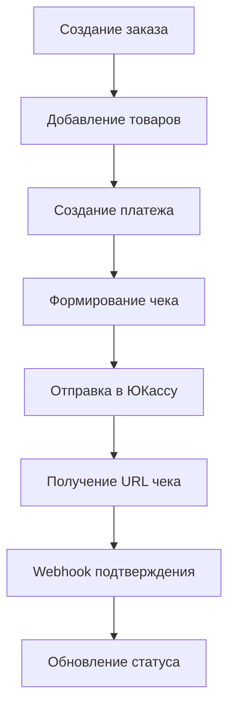

# 📄 Руководство по интеграции чеков ЮКасса согласно 54-ФЗ

## 🎯 Обзор

Данное руководство описывает интеграцию системы формирования чеков с платежной системой ЮКасса в соответствии с требованиями федерального закона № 54-ФЗ "О применении контрольно-кассовой техники".

### Основные возможности:
- ✅ Автоматическое формирование чеков при создании платежей
- ✅ Передача данных о товарах и покупателе в ЮКассу
- ✅ Поддержка различных форматов телефонных номеров
- ✅ Валидация данных согласно требованиям ЮКассы
- ✅ Получение URL чека после успешной оплаты

---

## 📋 Требования 54-ФЗ

### Обязательные реквизиты чека:
1. **Наименование товара/услуги** - до 128 символов
2. **Количество товара** - точное количество в формате "X.XX"
3. **Цена за единицу** - стоимость в рублях
4. **Сумма по позиции** - общая стоимость позиции
5. **Ставка НДС** - код ставки НДС (1-4)
6. **Признак предмета расчета** - тип товара/услуги
7. **Признак способа расчета** - тип оплаты

### Данные покупателя:
- **Полное имя** (обязательно) - ФИО покупателя для чека
- **Телефон** (обязательно) - номер в формате +7XXXXXXXXXX
- **Email** (опционально) - электронная почта

---

## 🏗️ Архитектура решения



### Компоненты системы:

#### 1. YooKassaReceiptDto
**Назначение**: DTO классы для формирования структуры чека

```java
@Data
@Builder
public class YooKassaReceiptDto {
    private CustomerDto customer;      // Данные покупателя
    private List<ReceiptItemDto> items; // Товарные позиции
}
```

#### 2. YooKassaPaymentService
**Методы для работы с чеками**:
- `buildReceipt(Order order)` - формирование чека из заказа
- `buildReceiptItem(OrderItem item)` - создание позиции чека
- `normalizePhoneNumber(String phone)` - нормализация телефона

---

## 🔧 Техническая реализация

### 1. Структура чека в запросе к ЮКассе

```json
{
  "amount": {
    "value": "1000.00",
    "currency": "RUB"
  },
  "description": "Оплата заказа №123",
  "receipt": {
    "customer": {
      "full_name": "Иванов Иван Иванович",
      "phone": "+79001234567"
    },
    "items": [
      {
        "description": "Пицца Маргарита",
        "quantity": "2.00",
        "amount": {
          "value": "800.00",
          "currency": "RUB"
        },
        "vat_code": 1,
        "payment_subject": "commodity",
        "payment_mode": "full_payment"
      },
      {
        "description": "Доставка",
        "quantity": "1.00",
        "amount": {
          "value": "200.00",
          "currency": "RUB"
        },
        "vat_code": 1,
        "payment_subject": "service",
        "payment_mode": "full_payment"
      }
    ]
  }
}
```

### 2. Коды НДС

| Код | Ставка НДС | Описание |
|-----|------------|----------|
| 1   | 0%         | НДС не облагается |
| 2   | 10%        | НДС 10% |
| 3   | 20%        | НДС 20% |
| 4   | Без НДС    | НДС не применяется |

**Для доставки еды используется код 1 (0%)**

### 3. Признаки предмета расчета

| Значение | Описание |
|----------|----------|
| commodity | Товар |
| service | Услуга |
| job | Работа |
| excise | Подакцизный товар |

### 4. Форматы телефонных номеров

Система автоматически нормализует различные форматы:

```java
// Поддерживаемые форматы:
+79001234567     // Международный формат
89001234567      // Российский формат с 8
79001234567      // Без плюса
9001234567       // Без кода страны
+7 (900) 123-45-67  // С разделителями
8 900 123 45 67    // С пробелами

// Результат нормализации: +79001234567
```

---

## 🚀 Использование API

### 1. Создание платежа с чеком

```http
POST /api/v1/payments/yookassa/create
Authorization: Bearer {jwt_token}
Content-Type: application/json

{
  "orderId": 123,
  "method": "SBP",
  "description": "Оплата заказа №123 в PizzaNat"
}
```

**Ответ с чеком:**
```json
{
  "id": 1001,
  "yookassaPaymentId": "2c5aa890-000f-5000-8000-18db351245c7",
  "orderId": 123,
  "status": "PENDING",
  "method": "SBP",
  "amount": 1000.00,
  "confirmationUrl": "https://yookassa.ru/checkout/payments/...",
  "receiptUrl": null,
  "createdAt": "2025-01-19T10:00:00Z"
}
```

### 2. Получение URL чека

После успешной оплаты чек становится доступен:

```http
GET /api/v1/payments/yookassa/{paymentId}
Authorization: Bearer {jwt_token}
```

**Ответ с URL чека:**
```json
{
  "id": 1001,
  "status": "SUCCEEDED",
  "receiptUrl": "https://receipt.yookassa.ru/...",
  "paidAt": "2025-01-19T10:05:00Z"
}
```

---

## 🧪 Тестирование

### Автоматические тесты

Запустите тестовый скрипт:

```bash
chmod +x scripts/test_yookassa_receipt_integration.sh
./scripts/test_yookassa_receipt_integration.sh
```

### Тестовые сценарии:

#### 1. Основной тест
- ✅ Регистрация пользователя с телефоном
- ✅ Создание заказа с товарами
- ✅ Создание платежа с автоматическим формированием чека
- ✅ Проверка статуса и получение URL чека

#### 2. Тест форматов телефонов
- ✅ Международный формат: +79001234567
- ✅ Российский с 8: 89001234567
- ✅ Без плюса: 79001234567
- ✅ Краткий: 9001234567
- ✅ С разделителями: +7 (900) 123-45-67

#### 3. Тест множественных товаров
- ✅ Заказ с 5+ различными товарами
- ✅ Разное количество каждого товара
- ✅ Корректное формирование всех позиций

#### 4. Негативные тесты
- ✅ Некорректный формат телефона
- ✅ Несуществующий заказ
- ✅ Пустая корзина

---

## 📊 Мониторинг и логи

### Логирование процесса формирования чека

```java
// Успешное формирование чека
log.debug("✅ Сформирован чек для заказа #{}: {} позиций, телефон {}", 
          orderId, itemsCount, normalizedPhone);

// Ошибки валидации
log.warn("⚠️ Не указан телефон покупателя для чека заказа #{}", orderId);
log.warn("⚠️ Некорректный формат телефона {} для чека заказа #{}", phone, orderId);

// Ошибки формирования
log.error("❌ Ошибка формирования чека для заказа #{}: {}", orderId, error);
```

### Метрики для мониторинга

- Количество сформированных чеков
- Процент ошибок валидации телефонов
- Время формирования чека
- Количество товарных позиций в чеках

---

## ⚠️ Частые проблемы и решения

### Проблема 1: Некорректный формат телефона
**Симптомы**: Чек не формируется, в логах предупреждение о телефоне

**Решение**:
```java
// Проверить нормализацию телефона
String normalized = normalizePhoneNumber(phone);
if (normalized == null) {
    // Телефон некорректен
}
```

### Проблема 2: Пустой список товаров
**Симптомы**: Чек не создается, нет товарных позиций

**Решение**:
- Убедиться что заказ содержит товары
- Проверить что товары не null в OrderItem

### Проблема 3: Слишком длинное название товара
**Симптомы**: Ошибка от ЮКассы о некорректном описании

**Решение**:
```java
// Автоматическое обрезание до 128 символов
if (description.length() > 128) {
    description = description.substring(0, 125) + "...";
}
```

### Проблема 4: Отсутствует URL чека после оплаты
**Симптомы**: receiptUrl остается null даже после SUCCEEDED

**Причины**:
- ЮКасса еще обрабатывает чек (может занять время)
- Ошибка в формировании чека при создании платежа

**Решение**:
- Повторная проверка через несколько минут
- Проверка логов на ошибки формирования чека

---

## 🔄 Webhook обработка

### Получение данных о чеке в webhook

```java
@PostMapping("/webhook")
public ResponseEntity<Void> handleWebhook(@RequestBody JsonNode webhook) {
    // Проверяем наличие данных о чеке
    if (webhook.has("object") && webhook.get("object").has("receipt_registration")) {
        JsonNode receipt = webhook.get("object").get("receipt_registration");
        
        if ("succeeded".equals(receipt.get("status").asText())) {
            String receiptUrl = receipt.get("receipt_url").asText();
            // Сохраняем URL чека в базе данных
        }
    }
    
    return ResponseEntity.ok().build();
}
```

---

## 📚 Дополнительные ресурсы

### Документация ЮКассы:
- [Чеки для других сервисов](https://yookassa.ru/developers/payment-acceptance/receipts/54fz/other-services/payments)
- [API объект платежа](https://yookassa.ru/developers/api#payment_object)
- [Процесс платежа](https://yookassa.ru/developers/payment-acceptance/getting-started/payment-process#capture-and-cancel)

### Нормативные документы:
- [54-ФЗ "О применении ККТ"](http://www.consultant.ru/document/cons_doc_LAW_200318/)
- [Требования к кассовым чекам](https://normativ.kontur.ru/document?moduleId=1&documentId=347077)

### Конфигурация проекта:
- `YooKassaConfig.java` - настройки интеграции
- `application.yml` - параметры подключения
- `V18__create_payments_table.sql` - миграция БД

---

## ✅ Чек-лист для внедрения

- [ ] Добавлены DTO классы для чеков (YooKassaReceiptDto)
- [ ] Обновлен YooKassaPaymentService с методами формирования чеков
- [ ] Проведены тесты с различными форматами телефонов
- [ ] Протестировано формирование чеков с множественными товарами
- [ ] Настроено логирование процесса формирования чеков
- [ ] Обновлена документация API
- [ ] Проведено нагрузочное тестирование
- [ ] Настроен мониторинг ошибок формирования чеков

**🎯 Результат**: Полностью функциональная система формирования фискальных чеков, соответствующая требованиям 54-ФЗ и интегрированная с ЮКассой. 